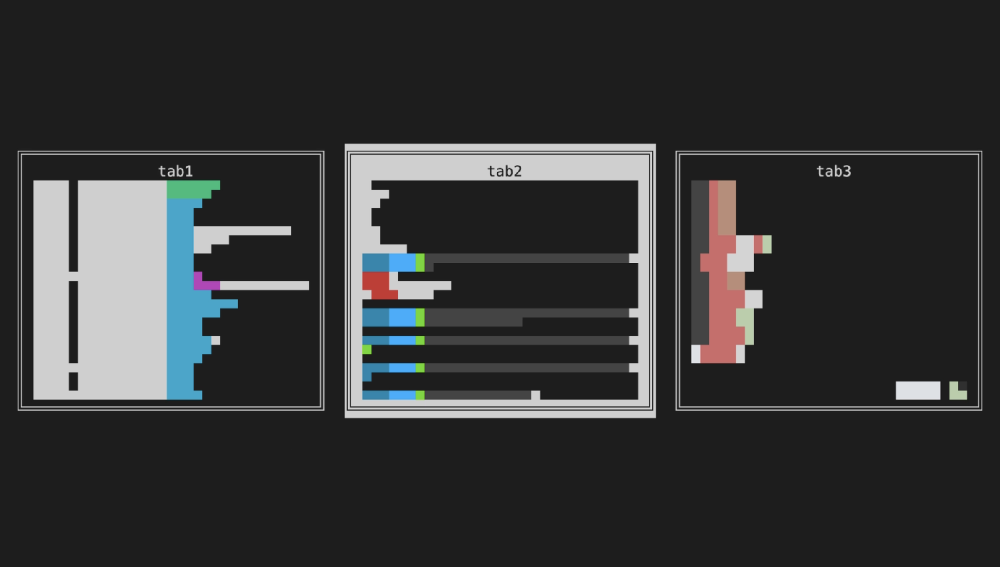

# Kitty MRU Tab Switcher

A fast, Mac/Orion-style tab switcher kitten for kitty. It opens an overlay in the current terminal window, shows a title and a downsampled text preview, and uses MRU ordering (last used tab at top of stack). Release Ctrl to commit the switch.



## Install

1) Copy this git repository into your kitty config directory. Often `~/.config/kitty`.
2) Add keybindings to `kitty.conf` (see below)

## Keybindings

Add to `kitty.conf` (the marker ensures the kitten always receives an initial event):

```
map ctrl+tab kitten /path/to/tab_switcher.py next
map ctrl+shift+tab kitten /path/to/tab_switcher.py prev
map --when-focus-on title:^KTS_SWITCHER$ ctrl+tab send_key tab
map --when-focus-on title:^KTS_SWITCHER$ ctrl+shift+tab send_key shift+tab
```

By default it uses the theme `themes/default.yaml`, but this is configurable (see below).


## Behavior

- `Ctrl+Tab` opens the switcher and selects the next MRU tab without switching.
- While holding Ctrl, `Tab` cycles forward, `Shift+Tab` cycles backward.
- Release Ctrl to commit the selection.
- `Esc` cancels and returns to the original tab.
 
The conditional mappings ensure `Ctrl+Tab` is delivered to the switcher window
instead of re-launching the kitten when the overlay is focused.

## Notes

- MRU order is stored per OS window and scoped to the current kitty session.
  The cache file is `KITTY_CACHE_DIRECTORY/kitty-tab-switcher.json`.
- Previews are text-based using `kitten @ get-text` for the active window in
  each tab.

## Customization

Edit constants at the top of `tab_switcher.py`:

- `PREVIEW_COLS`, `PREVIEW_ROWS`
- `MAX_VISIBLE_CARDS`
- `PREVIEW_NEIGHBORS`

### Themes (YAML)

You can customize borders, layout, and text by providing a YAML theme file.

Example:

```
map ctrl+tab kitten /path/to/tab_switcher.py next --theme /path/to/theme.yaml
map ctrl+shift+tab kitten /path/to/tab_switcher.py prev --theme /path/to/theme.yaml
```

Or set an environment variable:

```
export KTS_THEME=/path/to/theme.yaml
```

A sample theme is in `themes/default.yaml`.

Behavior options:

- `behavior.zoom_on_open`: When true, temporarily sets the active tab's layout to `stack` while the switcher is open, then restores the previous layout before switching tabs.

Performance options:

- `performance.preview_refresh_ms`: staleness threshold before preview refresh.
- `performance.preview_fetch_budget_ms`: minimum spacing between queued preview fetches.
- `performance.mod_poll_fast_ms`: modifier poll interval during active interaction.
- `performance.mod_poll_idle_ms`: modifier poll interval while idle.

Profiling:

- Set `KTS_PROFILE=1` to enable profiling.
- Optional: `KTS_PROFILE_PATH=/path/to/profile.jsonl`
- Optional: `KTS_PROFILE_SAMPLE_MS=100`
- Or pass `--profile` to the kitten args.

Profiler report helper:

```bash
python profile_report.py
python profile_report.py ~/.cache/kitty-tab-switcher-profile.jsonl --top 15
python profile_report.py --json
```

## Preview Debugging

You can debug the preview generation independently:

```
cat sample.txt | python preview_gen.py --cols 40 --rows 12
```

With ANSI colors from kitty:

```
python preview_capture.py --listen-on "unix:/tmp/kitty-3905" --ansi | python preview_gen.py --cols 40 --rows 12 --ansi
```

You can control how colors are applied:

- `--color-mode none` (monochrome)
- `--color-mode fg` (foreground only)
- `--color-mode bg` (background only)
- `--color-mode both` (foreground + background, default)

Or pass a file:

```
python preview_gen.py --cols 40 --rows 12 --file /path/to/sample.txt
```

## Preview Capture

Capture the raw terminal text for a window:

```
python preview_capture.py --window-id 123
```

If `--window-id` is omitted, it uses `KITTY_WINDOW_ID` from the environment.
You can also save to a file:

```
python preview_capture.py --window-id 123 --out /tmp/tab.txt
```

If you have multiple kitty instances, pass `--listen-on` (or set `KITTY_LISTEN_ON`):

```
python preview_capture.py --window-id 123 --listen-on "$KITTY_LISTEN_ON"
```

## Image Preview (Inline)

Render a colored image preview of the terminal and display it inline:

```
python preview_image.py --listen-on "$KITTY_LISTEN_ON" --inline
```

You can also save a PNG:

```
python preview_image.py --listen-on "$KITTY_LISTEN_ON" --out /tmp/preview.png
```

Note: This requires Pillow (`pip install pillow`).

For image-based preview, consider explicitly specifying a font with `--font path/to/font.ttf` in the commands in `kitty.conf`. This is especially helpful if you use Powerline or Nerd Fonts.
